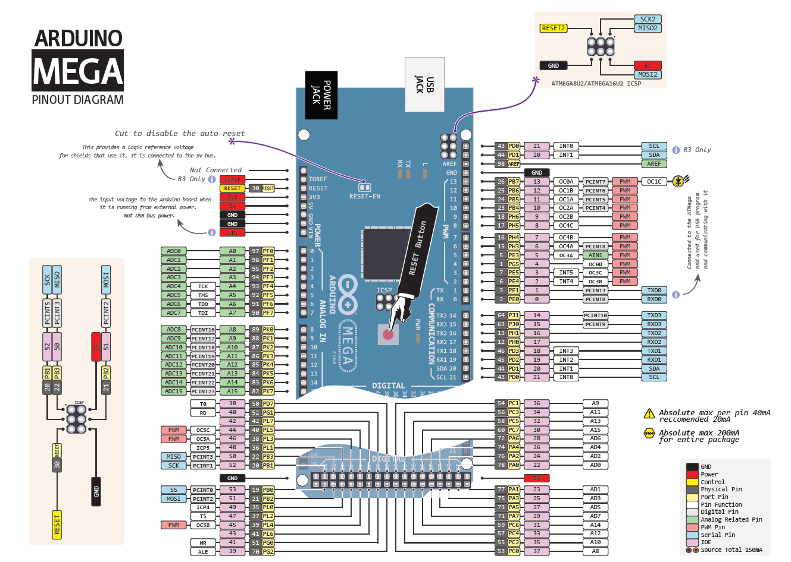

# microcontrollers-part1

## University Microcontrollers course (part1)

### Lab1

Algorithm for lighting 8 leds

<code>P7 → P0 → P6 → P1 → P5 → P2 → P4 → P3</code>

### Lab2

Algorithm for lighting 8 leds using  based on Serial communication

Pressing button connected to Arduino should activate corresponding algorithm in GUI.
While pressing button in LedInterfaceGUI should activate algorithm on Arduino

Algorithm1:
<code>P7 → P0 → P6 → P1 → P5 → P2 → P4 → P3</code>

Algorithm2:
<code>P0, P7 → P1, P6 → P2, P5 → P3, P4</code>

### Lab3

Realization of stopwatch with memory for 60 records using liquid crystal display and 4x4 keypad
